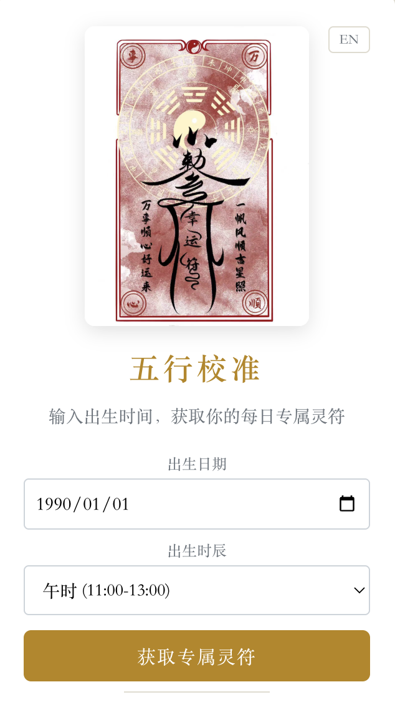
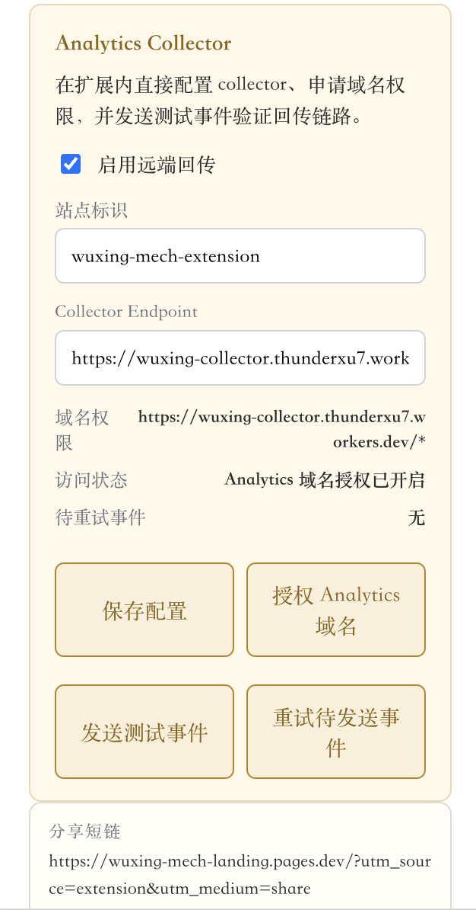

# 五行校准 · WuXing Calibrate

> 算法驱动的每日能量校准 Chrome 扩展。输入出生时间，获取你的每日专属灵符。

| 首屏 | 灵符结果 | 上线设置 |
|:---:|:---:|:---:|
|  |  |  |

---

## 它做什么

- **每日灵符**：基于出生时间的五行能量签名，每天生成一张专属灵符。
- **能量分布**：直观查看金 / 木 / 水 / 火 / 土 的当日强弱与综合评分。
- **分享与提醒**：一键保存分享图、复制文案，每日定时提醒不错过。

中英双语，支持运行时切换。本工具仅供娱乐与参考。

---

## 安装

目前未上架 Chrome Web Store，使用开发者模式加载本地构建。

```sh
git clone git@github.com:thunderxu7-sketch/wuxing-mech-extension.git
cd wuxing-mech-extension
npm install
npm run build
```

然后在 Chrome 里：

1. 打开 `chrome://extensions`
2. 右上角开启 **Developer mode**
3. 点 **Load unpacked**，选择仓库下的 `dist/` 目录
4. 在工具栏点开扩展图标，输入出生时间即可

---

## 配置

v1 默认值已经接入真实落地页和 collector，无需任何额外配置即可使用。如果你 fork 这个项目并想替换成自己的，按以下步骤改：

### 分享落地页 / 短链

默认值在 [`src/config/share.ts`](src/config/share.ts)：

```ts
export const DEFAULT_SHARE_URL = 'https://wuxing-mech-landing.pages.dev/?utm_source=extension&utm_medium=share';
export const DEFAULT_SHORT_URL = DEFAULT_SHARE_URL;
```

落地页的源在 [`landing/`](landing/) 目录下，是一个最小化的双语静态站点。部署到 Cloudflare Pages 的步骤见 [`landing/README.md`](landing/README.md)。

也可以在不改代码的前提下，通过 `chrome.storage.local` 在运行时覆盖：

```js
await chrome.storage.local.set({
  wuxing_share_config: {
    shareUrl: 'https://your-landing-page.example.com/',
    shortUrl: 'https://wx.example/s/daily',
  },
});
```

### Analytics Collector

默认值在 [`src/config/analytics.ts`](src/config/analytics.ts)：

```ts
export const DEFAULT_ANALYTICS_ENDPOINT = 'https://wuxing-collector.thunderxu7.workers.dev/collect';
export const DEFAULT_ANALYTICS_SITE = 'wuxing-mech-extension';
export const DEFAULT_ANALYTICS_ENABLED = true;
```

Collector 是一个 Cloudflare Worker + D1，源在 [`collector/`](collector/) 目录下。要部署你自己的，看 [`collector/README.md`](collector/README.md)。

数据**不会**未经用户同意就离开浏览器：扩展使用 `optional_host_permissions`，每个 collector origin 都需要用户在 popup 的「上线设置」面板里点一次「授权 Analytics 域名」，Chrome 才会允许实际的网络请求。

发送的事件 envelope 长这样：

```json
{
  "name": "popup_open",
  "site": "wuxing-mech-extension",
  "installId": "uuid",
  "sessionId": "uuid",
  "timestamp": "2026-04-10T08:30:00.000Z",
  "day": "2026-04-10",
  "properties": {}
}
```

跟踪的事件包括：
`popup_open` · `first_open` · `return_visit` · `onboarding_view` · `birth_submit` · `fortune_generated` · `detail_expand` · `detail_collapse` · `product_refresh` · `product_click` · `share_save` · `share_copy` · `locale_switch`

加上一个手动触发的 `analytics_probe`，由 popup 里「发送测试事件」按钮发出，用来验证回传链路。

---

## 开发

```sh
npm run dev      # vite 开发服务器，浏览器预览（非扩展环境）
npm run build    # 产出 dist/，可直接 Load unpacked
npm test         # node:test 跑算法 / 缓存 / 时辰 / analytics 等单元测试
npm run lint     # eslint
```

### 仓库结构

```
src/
  api/           # chrome.storage 与 analytics 封装
  config/        # 落地页、collector 等可替换常量
  ui/            # Popup 组件、组件库、分享图生成
  utils/         # 算法、时辰、签名计算
  locales/       # 中英文案
  background.ts  # 每日提醒 alarms + notifications
public/          # vite 直接拷贝到 dist 的静态资源（含 manifest.json 与图标）
landing/         # 独立的静态落地页（Cloudflare Pages）
collector/       # 独立的 analytics collector Worker（Cloudflare Workers + D1）
docs/            # 路线图、待办、截图
tests/           # node:test 单元测试
```

---

## 上线核对清单

发布前手工跑一遍：

1. ✅ `npm run build` / `npm test` / `npm run lint` 全绿
2. ✅ 落地页 URL 已经替换成真实地址（带 UTM 参数）
3. ✅ Collector endpoint 可访问，`/health` 返回 `{"status":"ok"}`
4. ⬜ 真实安装一次 → 输入出生信息 → 生成运势 → 保存分享图 → 扫码打开短链 → 在 collector D1 里能查到事件
5. ⬜ 触发一次每日提醒，确认能正确打开扩展
6. ⬜ 商品链接走真实联盟参数，能在后台看到点击归因

下一阶段规划见 [`docs/roadmap-2026-04.md`](docs/roadmap-2026-04.md)。
